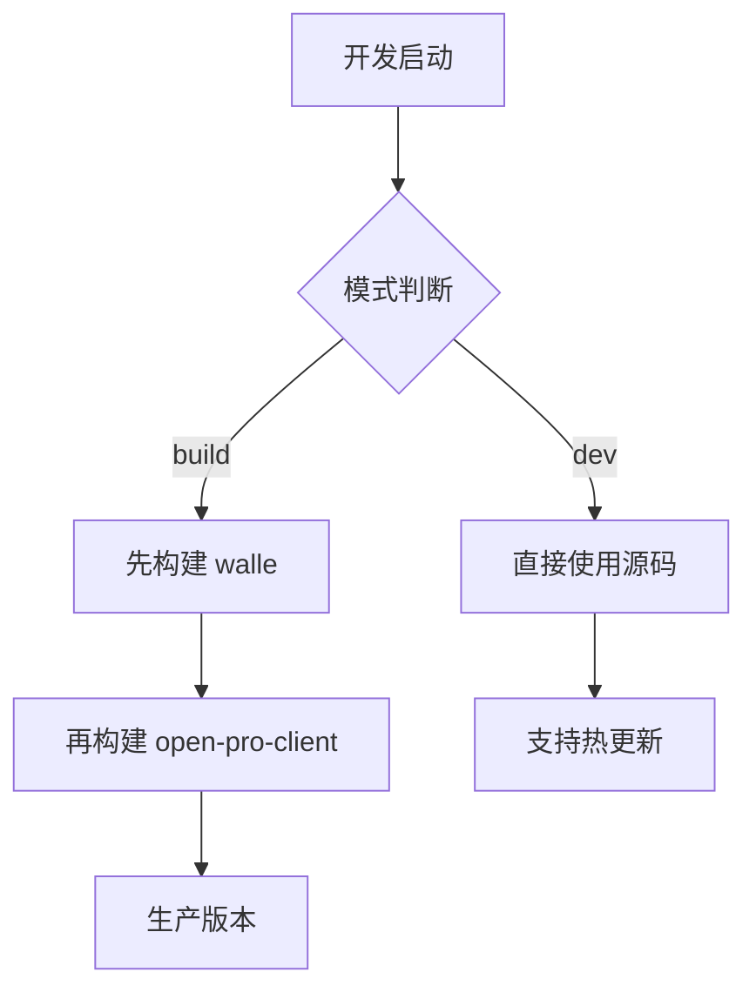

# Walle 包开发与构建策略

## 📦 设计目标

- **开发模式**: `open-pro-client` 直接使用 `walle` 源码，支持热更新和调试
- **构建模式**: `open-pro-client` 使用预构建的 `walle` 包，确保稳定性
- **第三方使用**: 通过发布的构建版本使用 `walle`

## 🔧 实现机制

### 1. Package.json Exports 配置

```json
{
  "exports": {
    ".": {
      "development": {
        "types": "./src/index.ts",
        "import": "./src/index.ts",
        "require": "./src/index.ts"
      },
      "types": "./dist/index.d.ts",
      "import": "./dist/index.mjs",
      "require": "./dist/index.js"
    },
    "./src": {
      "types": "./src/index.ts",
      "import": "./src/index.ts",
      "require": "./src/index.ts"
    }
  }
}
```

### 2. Vite 条件解析

```typescript
// electron.vite.config.ts
resolve: {
  conditions: command === 'serve' ? ['development', 'default'] : ['production', 'default'],
}
```

### 3. Turbo 构建策略

```json
{
  "dev": {
    "dependsOn": [], // 开发模式不依赖构建
    "persistent": true
  },
  "build:*": {
    "dependsOn": ["^build"], // 构建模式依赖 walle 先构建
    "cache": true
  }
}
```

## 🚀 使用方式

### 开发模式 (使用源码)

```bash
# 直接使用 walle 源码，支持热更新
pnpm dev --filter=open-pro-client
```

### 构建模式 (使用构建版本)

```bash
# 先构建 walle，再构建 open-pro-client
pnpm build:prod --filter=open-pro-client
```

### 第三方项目使用

```bash
# 安装发布的包
npm install @xmov/walle

# 自动使用 dist 版本
import { WalleClient } from '@xmov/walle'
```

## 📊 工作流程



## ✅ 优势

- 🔄 **开发效率**: 源码直接使用，支持热更新
- 🏗️ **构建稳定**: 构建版本使用编译后的代码
- 📦 **第三方友好**: 发布的包包含完整的 dist 和源码
- ⚡ **性能优化**: 构建版本经过优化和打包
